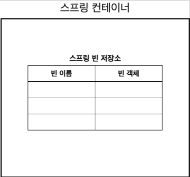

# 📌 스프링으로 전환하기
<br>

> 기존 진행해왔던 프로젝트 소스 기반


## AppConfig 스프링 기반으로 변경

```java
// application 전체를 설정하고 구성하기 위한 클래스 중요!!
@Configuration
public class AppConfig {

    /* 리팩토리전
    public MemberService memberService() {
        return new MemberServiceImpl(new MemoryMemberRepository());
    }

    public OrderService orderService() {
        return new OrderServiceImpl(new MemoryMemberRepository(), new FixDiscountPolicy());
    }
    */

    /*
    리팩토링 후 메소드 정리
     */
    @Bean
    public MemberService memberService() {
        return new MemberServiceImpl(memberRepository());
    }

    @Bean
    public OrderService orderService() {
        return new OrderServiceImpl(memberRepository(), discountPolicy());
    }

    //이제 이 부분의 생성객체만 변경하면 다른 db 사용이 가능한 구조로된것
    @Bean
    public MemberRepository memberRepository() {
        return new MemoryMemberRepository();
    }

    @Bean
    public DiscountPolicy discountPolicy() {
//        return new FixDiscountPolicy();
        return new RateDiscountPolicy();
    }


}
```

#### - AppConfig에 설정을 구성한다는 뜻의 @Configuration을 붙여준다.
#### - 각 메서드에 @Bean을 붙여줌! 이렇게하면 스프링 컨테이너에 빈으로 등록된다.

<br>


### ✏️   MemberApp에 스프링 컨테이너 적용

```java
public class MemberApp {
    public static void main(String[] args) {

//        AppConfig appConfig = new AppConfig();

//        MemberService memberService = appConfig.memberService();

        //이렇게 설정함으로써 해당클래스를 스프링이 빈으로 등록해서 관리한다.
        ApplicationContext applicationContext = new AnnotationConfigApplicationContext(AppConfig.class);
        //파라미터 1: 찾을 메서드 이름, 파라미터2 : 클래스
        MemberService memberService = applicationContext.getBean("memberService", MemberService.class);

        //AppConfig 설정 이후 위 코드로 변경
        //MemberService memberService = new MemberServiceImpl();


        Member member = new Member(1L, "전도현", Grade.VIP);
        memberService.join(member);

        Member findMember = memberService.findMember(1L);
        System.out.println("new Member = " + member.getName());
        System.out.println("find Member = " + findMember.getName());


    }

}
```

<br>

### MemberApp의 실행 로그 화면 


<br>

### ✏️   OrderApp에 스프링 컨테이너 적용

```java
public class OrderApp {

    public static void main(String[] args) {
        //AppConfig 이후
//        AppConfig appConfig = new AppConfig();
//        MemberService memberService = appConfig.memberService();
//        OrderService orderService = appConfig.orderService();


        //MemberService memberService = new MemberServiceImpl();
        //OrderService orderService = new OrderServiceImpl();

        ApplicationContext applicationContext = new AnnotationConfigApplicationContext(AppConfig.class);

        MemberService memberService = applicationContext.getBean("memberService", MemberService.class);

        OrderService orderService = applicationContext.getBean("orderService", OrderService.class);

        Long memberId = 1L;
        Member member = new Member(memberId,"memberA", Grade.VIP);
        memberService.join(member);

        Order order = orderService.createOrder(memberId,"itemA",10000);

        System.out.println("order = " + order);

    }
}
```

<br>

### ✏️ 스프링 컨테이너란?



#### > 스프링 컨테이너는 자바 객체의 생명주기를 관리하며, 생성된 자바 객체들에게 추가적인 기능을 제공하는 역할을 한다.
#### > 자바 객체를 스프링에선 Bean 이라고 부르고 IoC와 DI의 원리가 이 스프링 컨테이너에 적용된다.
#### > new 연산자와 인터페이스 호출, 팩토리 호출 방식으로 객체를 생성,소멸 시킬수있는데 스프링 컨테이너가 이 역할을 대신해준다.
#### > 스프링 컨테이너 안에 빈 저장소가 있고 그 안에 빈이 있다고 생각하면된다.


👉 참조 : [인프런](https://www.inflearn.com/)의 김영한님
**강의 , [남궁성님의 자바의정석] ,[블로그 참고](https://steady-coding.tistory.com/459)

<br>
🌜 개인 공부 기록용 블로그입니다. 오류나 틀린 부분이 있을 경우 
언제든지 댓글 혹은 메일로 지적해주시면 감사하겠습니다! 😄
<br>

**개인메모**_
스프링 컨테이너 종류에 대해 추가 학습및 정리가 필요할 것 같다.